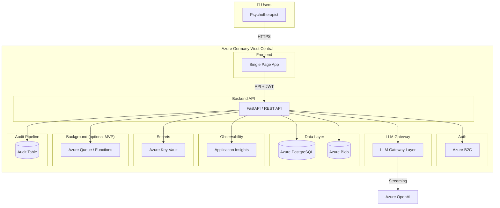
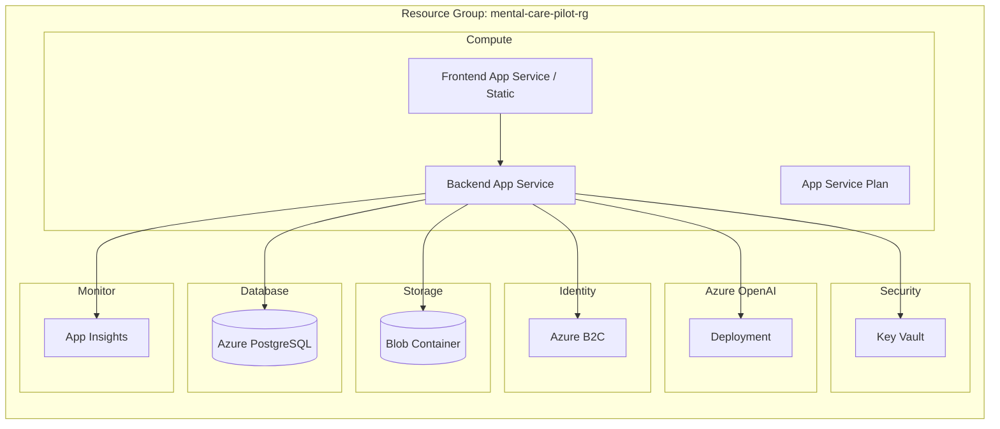

# MentalCarePilot MVP 0.1 — Target Architecture

**Version:** 0.1  
**Date:** 2025-02-19  
**Region:** Azure Germany West Central  
**Constraint:** No Kubernetes in V1

---

## 1. High-Level Architecture



---

## 2. Component Overview

| Component | Role | Technology |
|-----------|------|------------|
| **Frontend** | SPA for chat UI, folders, settings | React/Vite or Next.js |
| **Backend API** | REST API, auth, tenant resolution, LLM proxy | FastAPI (Python) |
| **Auth** | Identity, tenant/role claims | Azure B2C |
| **LLM Gateway** | System prompt injection, anonymization, streaming proxy | In-process service layer |
| **Database** | Tenants, users, folders, conversations, messages, domain_events, ai_responses, audit | Azure PostgreSQL |
| **Blob Storage** | Exports, attachments (MVP: minimal) | Azure Blob |
| **Logging** | Structured logs, no PII | Application Insights |
| **Background Jobs** | Deletion workflow, usage aggregation (MVP: optional) | Azure Functions / Queue |
| **Audit Pipeline** | Immutable audit events | PostgreSQL (audit_logs, usage_records) + optional export |

**Admin Section (2025-02-20):** `usage_records` for KPI aggregation; `audit_logs` extended with assist_mode, model_name, input/output tokens. Admin page: KPIs (tokens, chats, assist modes, models) and searchable audit logs. API: [ADMIN_API.md](ADMIN_API.md). Flow: [admin-kpis-logs-flow.md](diagrams/admin-kpis-logs-flow.md).

---

## 3. Data Flow — Streaming Chat

See [sequence-chat-streaming.mmd](diagrams/sequence-chat-streaming.mmd) for full flow with DB. Safe Mode: [seq-safe-mode.mmd](diagrams/flows/seq-safe-mode.mmd).

```mermaid
sequenceDiagram
    participant U as User
    participant SPA as Frontend
    participant API as Backend API
    participant GW as LLM Gateway
    participant AO as Azure OpenAI

    U->>SPA: Type or dictate message + send (assist_mode, safe_mode, anonymize)
    SPA->>API: POST /chats/{id}/messages (body)
    API->>API: Resolve tenant_id from JWT
    API->>API: Anonymize if enabled
    API->>API: If safe_mode: append strict modifier to system prompt
    API->>GW: request(system_prompt, messages)
    GW->>GW: Inject Assistenzmodus / preset
    GW->>AO: Chat Completions (stream)
    AO-->>GW: SSE stream
    GW-->>API: Stream chunks
    API-->>SPA: SSE stream
    SPA-->>U: Render tokens
    API->>API: Persist message, usage_records, audit_logs (metadata only; no prompt/response)
```

---

## 4. Deployment Topology



---

## 5. Layer Responsibilities

### 5.1 Frontend

- **Delivery:** Same SPA is served as browser app, installable PWA (manifest + service worker), and native iOS/Android via Capacitor. Build output: `apps/web/dist`. See [mobile.md](mobile.md) and [mobile-delivery-pwa-capacitor.mmd](diagrams/flows/mobile-delivery-pwa-capacitor.mmd).
- Auth: Redirect to B2C, handle callback at `/auth/callback` (web or `capacitor://localhost/auth/callback` in native). Redirect URI from `VITE_AUTH_REDIRECT_URI` or runtime (Capacitor vs web). See [seq-auth-callback.mmd](diagrams/flows/seq-auth-callback.mmd).
- EU Processing Notice: Visible banner on Chat and Login ("Alle Daten werden innerhalb der EU verarbeitet."); dismissible (localStorage); /privacy page for Datenschutz
- Chat: Send messages, consume SSE stream; assist mode dropdown (custom, mobile-readable); Voice dictation (microphone icon, Web Speech API; no audio stored); Export (TXT/PDF) per conversation; Lock/Finalize action for medico-legal documentation (freezes chat; export remains available)
- KI-Antworten: Process markdown via /ai-responses; render structured blocks; Timeline with expandable preview
- Folders: CRUD, link conversations; filter chats by folder; assign chat to folder via dropdown
- Admin: KPIs tab (tokens, chats, assist modes, models), Logs tab (searchable audit logs)
- Assistenzmodus / Anonymization / Safe Mode: Toggle UI, pass flags to API; Safe Mode persisted per chat in `chats.metadata`
- Preset prompts: Fetch list, apply selection (API injects); /assist page to view and edit prompt templates

### 5.2 Backend API

- Case Summary: `POST /cases/summary` — cross-conversation summary (draft only; no diagnosis, no treatment recommendation). Audit: `cross_case_summary_generated`. Flow: [case-summary-flow.md](diagrams/case-summary-flow.md)
- Auth middleware: Validate JWT, extract tenant_id + user_id
- Tenant enforcement: All queries filtered by tenant_id
- LLM Gateway: Proxy to OpenAI, inject prompts, anonymize; Safe Mode appends strict modifier (conservative phrasing, no absolutes)
- CRUD: Tenants, users, folders, conversations, messages; Export: GET `/chats/{id}/export?format=txt|pdf` (audit: export_requested, metadata only); Finalize: POST `/chats/{id}/finalize` (emits `chat.finalized`; blocks PATCH/send/delete when finalized)
- Admin API: `/admin/kpis/*` (summary, tokens, chats, assist-modes, models, activity), `/admin/audit-logs` (filterable, searchable)
- AI Responses API: POST/GET `/ai-responses` (process markdown, list by entity); POST `/ai-responses/actions/execute` (log action)
- Audit: Write audit events for sensitive actions; usage_records + audit_logs for LLM requests; domain_events for AI responses

### 5.3 LLM Gateway Layer

- System prompt: Server-side only; never client-controllable; Safe Mode appends strict modifier when `safe_mode=true`
- Preset prompts: Versioned, fetched from DB or config
- Anonymization: Replace PII before sending to OpenAI
- Streaming: Forward SSE, no buffering of full response in logs
- Token tracking: Count tokens per request for usage table

---

## 6. Key Design Decisions

| Decision | Choice | Rationale |
|----------|--------|-----------|
| Compute | App Service | Simpler than Container Apps; good enough for MVP |
| No K8s | App Service / Functions | Avoid orchestration complexity |
| Single DB | One PostgreSQL | RLS provides tenant isolation; simpler ops |
| LLM proxy | Backend-side only | Control prompts, no client→OpenAI direct |
| Audit | Table in same DB | Simple; export later if needed |

---

## 7. Cross-Cutting Concerns

- **Tenant ID:** From B2C custom claim or app-specific mapping; set in request context
- **Correlation ID:** Per request for tracing
- **PII:** Never in logs; use placeholders (user_123, tenant_456)
- **Encryption:** TLS in transit; Azure PG + Blob encrypted at rest

---

## 8. Frontend Responsive Layout

The SPA is mobile-first. Breakpoints: xs 390px, sm 640px, md 768px, lg 1024px, xl 1280px.

- **< 768px:** Hamburger nav, overlay drawer. Chat: list OR detail (single view).
- **≥ 768px:** Sidebar nav. Chat: list + detail side by side.
- Touch targets: 44×44px minimum for primary actions.
- No horizontal scrolling on mobile/tablet.

See `docs/diagrams/mobile-responsive-layout.md`.

---

## 9. Diagram Files

- EU Processing Notice: `docs/diagrams/flows/seq-eu-notice.mmd`
- Safe Prompt Mode: `docs/diagrams/flows/seq-safe-mode.mmd`
- Mobile layout: `docs/diagrams/mobile-responsive-layout.md`
- High-level: `docs/diagrams/architecture-high-level.mmd`
- Data flow: `docs/diagrams/sequence-chat-streaming.mmd`
- Deployment: `docs/diagrams/deployment-topology.mmd`
- AI Response Rendering: `docs/diagrams/ai-response-rendering-flow.mmd`, `docs/diagrams/flows/seq-ai-response.mmd`
- Admin KPIs & Logs: `docs/diagrams/admin-kpis-logs-flow.md`
- Folder Management: `docs/diagrams/folder-management-flow.md`
- Assistenzmodus Prompt Management: `docs/diagrams/assistenzmodus-prompt-management-flow.mmd`
- Chat Export (PDF/TXT): `docs/diagrams/export-chat-flow.md`
- Chat Finalize (Lock): `docs/diagrams/chat-finalize-flow.md`
- Case Summary (Cross-Conversation): `docs/diagrams/case-summary-flow.md`
- Voice-to-Text Dictation: `docs/diagrams/voice-dictation-flow.md`
- Structured Session Documentation (EPIC 14): `docs/diagrams/structured-session-documentation-flow.md`
- Mobile delivery (PWA + Capacitor): `docs/diagrams/flows/mobile-delivery-pwa-capacitor.mmd`, `docs/diagrams/flows/seq-auth-callback.mmd`

## 10. AI Response Rendering Engine (EPIC 13)

Markdown from AI is sanitized, parsed into structured blocks, and stored as domain events. See `docs/events.md` for AI event types. Pipeline: Sanitize → Block Extract → Action Detect → Store → Render.

See `INFRASTRUCTURE_DECISION.md` for concrete service choices and tradeoffs.

---

## 11. Folder Management (2025-02-20)

- **Workflow:** Create folder → Assign chat (PATCH /chats) → Filter by folder (GET /chats?folder_id) → Delete folder (chats move to Unfiled)
- **Events:** `folder.created`, `folder.renamed`, `folder.deleted`, `chat.folder_changed`
- **API:** GET/POST/PATCH/DELETE `/folders`; `GET /chats?folder_id=&unfiled_only=`; `PATCH /chats` accepts `folder_id`
- **Diagram:** See [folder-management-flow.md](diagrams/folder-management-flow.md)

### 11.1 Conversation Lock / Finalize (2025-02-20)

- **Workflow:** User clicks "Abschließen" → `POST /chats/{id}/finalize` → `chats.status` = `finalized`; event `chat.finalized` emitted
- **State:** `active` (default) | `finalized`. When finalized: PATCH, send message, delete return 409; export remains allowed
- **Diagram:** See [chat-finalize-flow.md](diagrams/chat-finalize-flow.md)

---

## 12. Structured Session Documentation (EPIC 14, 2026-02-20)

- **Structured Session Templates (1.1):** Schema-driven documentation with optional fields (session_context, presenting_symptoms, resources, interventions, homework, risk_assessment, progress_evaluation). Toggle Chat View / Structured View in UI. Table `structured_session_documents` (tenant_id, conversation_id, version, content JSONB). RLS enforced. Events: `structured_document.created`, `structured_document.updated`, `structured_document.versioned`.
- **Intervention Suggestion Library (1.2):** Table `intervention_library` (global + tenant). Evidence-informed, non-prescriptive. UI: "Interventionsideen" panel. Events: `intervention_suggested`, `intervention_viewed`.
- **Automatic Session Structuring (1.3):** Button "In Struktur umwandeln" triggers server-side LLM transformation; conversation → structured JSON → validation → store. Events: `structured_document.generated`, `structured_document.validation_failed`. PDF export includes structured document section when present.

---

## 13. What changed

### 2026-02-21 (Mobile App Packaging — PWA + Capacitor)

- **PWA:** Same SPA is installable (manifest, service worker with autoUpdate). App shell/assets cached; API and streaming endpoints not cached so chat streaming is unchanged.
- **Capacitor:** Native iOS and Android apps wrap `apps/web/dist`; scripts: `pnpm run cap:sync`, `android`, `ios`. See [mobile.md](mobile.md).
- **Auth redirects:** Callback route `/auth/callback`; redirect URI config via `VITE_AUTH_REDIRECT_URI` or runtime (Capacitor: `capacitor://localhost/auth/callback`). B2C app registration must allow these URIs. Flows: [mobile-delivery-pwa-capacitor.mmd](diagrams/flows/mobile-delivery-pwa-capacitor.mmd), [seq-auth-callback.mmd](diagrams/flows/seq-auth-callback.mmd).

### 2026-02-20 (EPIC 14 — Structured Clinical Documentation)

- **Structured Session Documentation:** Chat/Structured view toggle, structured form (7 fields), "In Struktur umwandeln" (LLM conversion), intervention library panel. Tables: `structured_session_documents`, `intervention_library`. PDF export includes structured section when present. See §12.

### 2026-02-20 (Voice-to-Text Dictation)

- **Voice dictation:** Microphone icon near chat input; browser Web Speech API (de-DE). Click to start → "Aufnahme läuft..." → click stop → transcribed text inserted; user can edit before send. No audio stored or uploaded; only text sent to backend. Button hidden when API unsupported (e.g. Firefox). Flow: [voice-dictation-flow.md](diagrams/voice-dictation-flow.md).

### 2026-02-20 (Case Summary — Cross-Conversation)

- **Case Summary:** Therapists can generate a cross-conversation summary from chats in a folder. `POST /cases/summary` with `conversation_ids`; returns structured `case_summary`, `trends`, `treatment_evolution`. Draft support only; no diagnosis; no treatment recommendation; no automatic storage. UI: "Fallzusammenfassung generieren" in folder view; modal with disclaimer "KI-gestützte Zusammenfassung – keine diagnostische Entscheidung." Audit: `cross_case_summary_generated`. Flow: [case-summary-flow.md](diagrams/case-summary-flow.md).

### 2026-02-20 (Safe Prompt Mode — Strenger Sicherheitsmodus)

- **Safe Mode toggle:** "Strenger Sicherheitsmodus" near Assistenzmodus dropdown. When ON: shorter, conservative responses; no absolute medical claims; no speculative language. Server appends strict modifier to system prompt (no client injection). Persisted per conversation in `chats.metadata.safe_mode`. Flow: [seq-safe-mode.mmd](diagrams/flows/seq-safe-mode.mmd).

### 2025-02-20 (Conversation Lock / Finalize)

- **Lock/Finalize (MVP):** Therapists can finalize a chat for medico-legal documentation. `POST /chats/{id}/finalize` sets `status=finalized`, emits `chat.finalized`. PATCH, send message, and delete return 409 when finalized; export (TXT/PDF) remains available. Flow: [chat-finalize-flow.md](diagrams/chat-finalize-flow.md).

### 2025-02-20 (Export)

- **Export (MVP 5.2):** Per-chat export as PDF and TXT. Endpoint: `GET /chats/{id}/export?format=txt|pdf`. Audit: `export_requested` in `audit_logs` (metadata only, no content). Flow: [export-chat-flow.md](diagrams/export-chat-flow.md).

### 2026-02-20

- **AI Confidence Indicator:** Badge below all AI responses: "KI-Entwurf – fachliche Prüfung erforderlich." (optional "Modellvertrauen: X%" when confidence available). Shown on Chat and KI-Antworten pages. No event/schema change.
- **Continue Session – Smart Context Banner:** When opening an existing chat with messages, a contextual banner shows "Letzte Aktivität vor X Tagen – Kontext wird fortgeführt." plus optional session length (days) and total tokens. GET /chats/{id} extended with `last_message_at`, `first_message_at`, `total_tokens_in_session`. Tokens computed from `audit_logs` (chat_message_sent) joined to `chat_messages`. Flow: [chat-context-banner-flow.md](diagrams/chat-context-banner-flow.md).
- **EU Processing Notice (4.1):** Visible banner "Alle Daten werden innerhalb der EU verarbeitet." on Chat and Login; dismissible (localStorage); "Mehr erfahren" links to /privacy. Flow: [seq-eu-notice.mmd](diagrams/flows/seq-eu-notice.mmd).
- **Mobile-first UI:** Hamburger nav (< 768px), fixed sidebar (≥ 768px). Chat: single view on mobile (list or detail), split view on desktop. Touch targets 44px. Flow: [mobile-responsive-layout.md](diagrams/mobile-responsive-layout.md).
- **Chat streaming:** Endpoint corrected in docs: `POST /chats/{id}/messages`. Backend: singleton Azure OpenAI client (avoids httpx cleanup error); safe `usage` handling on streaming chunks.

### 2025-02-20

- **Admin Section:** KPIs tab (tokens, chats, assist modes, models, activity); Logs tab (searchable audit logs). API: [ADMIN_API.md](ADMIN_API.md). Flow: [admin-kpis-logs-flow.md](diagrams/admin-kpis-logs-flow.md). Chat streaming now writes `usage_records` + `audit_logs` (metadata only).
- **Assistenzmodus Page:** Nutzer können alle Systemprompt-Vorlagen auf /assist anzeigen und bearbeiten. PATCH /prompts/{key} erstellt neue Version. Flow: [assistenzmodus-prompt-management-flow.mmd](diagrams/assistenzmodus-prompt-management-flow.mmd)
- **Assist Mode Templates:** SESSION_SUMMARY, STRUCTURED_DOC, THERAPY_PLAN, RISK_ANALYSIS mit klinischen Dokumentationsformaten (de-DE, strukturiertes Markdown, keine Diagnose/Behandlungsempfehlung). Migrations 004–007.
- **AI Response Rendering (EPIC 13):** Markdown → Sanitize → Block Extract → Action Detect → Store. `domain_events` + `ai_responses`; API `/ai-responses`; UI: KI-Antworten-Seite, Timeline, AIResponseRenderer. Flow: [ai-response-rendering-flow.mmd](diagrams/ai-response-rendering-flow.mmd).
