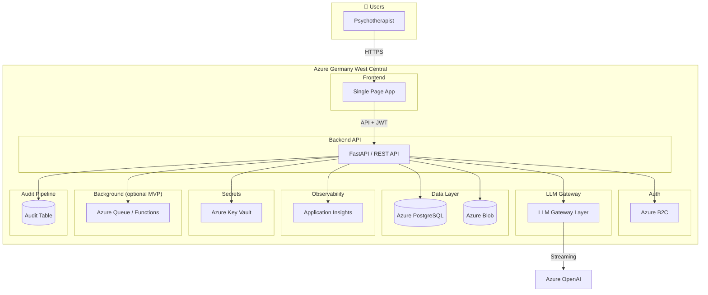
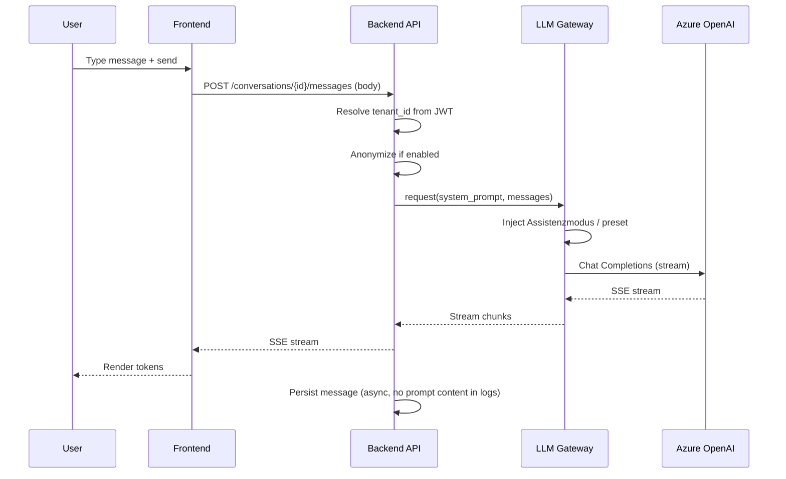
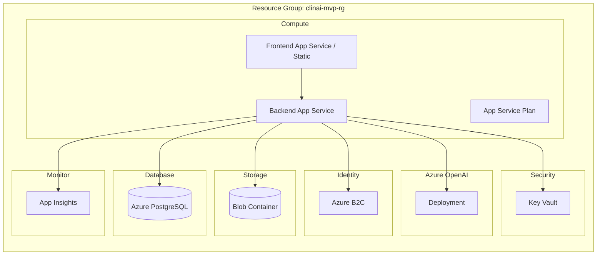

# ClinAI MVP 0.1 — Target Architecture

**Version:** 0.1  
**Date:** 2025-02-19  
**Region:** Azure Germany West Central  
**Constraint:** No Kubernetes in V1

---

## 1. High-Level Architecture

---

## 2. Component Overview

| Component | Role | Technology |
|-----------|------|------------|
| **Frontend** | SPA for chat UI, folders, settings | React/Vite or Next.js |
| **Backend API** | REST API, auth, tenant resolution, LLM proxy | FastAPI (Python) |
| **Auth** | Identity, tenant/role claims | Azure B2C |
| **LLM Gateway** | System prompt injection, anonymization, streaming proxy | In-process service layer |
| **Database** | Tenants, users, folders, conversations, messages, audit | Azure PostgreSQL |
| **Blob Storage** | Exports, attachments (MVP: minimal) | Azure Blob |
| **Logging** | Structured logs, no PII | Application Insights |
| **Background Jobs** | Deletion workflow, usage aggregation (MVP: optional) | Azure Functions / Queue |
| **Audit Pipeline** | Immutable audit events | PostgreSQL table + optional export |

---

## 3. Data Flow — Streaming Chat

---

## 4. Deployment Topology

---

## 5. Layer Responsibilities

### 5.1 Frontend

- Auth: Redirect to B2C, handle callback, store tokens
- Chat: Send messages, consume SSE stream
- Folders: CRUD, link conversations
- Assistenzmodus / Anonymization: Toggle UI, pass flags to API
- Preset prompts: Fetch list, apply selection (API injects)

### 5.2 Backend API

- Auth middleware: Validate JWT, extract tenant_id + user_id
- Tenant enforcement: All queries filtered by tenant_id
- LLM Gateway: Proxy to OpenAI, inject prompts, anonymize
- CRUD: Tenants, users, folders, conversations, messages
- Audit: Write audit events for sensitive actions

### 5.3 LLM Gateway Layer

- System prompt: Server-side only; never client-controllable
- Preset prompts: Versioned, fetched from DB or config
- Anonymization: Replace PII before sending to OpenAI
- Streaming: Forward SSE, no buffering of full response in logs
- Token tracking: Count tokens per request for usage table

---

## 6. Key Design Decisions

| Decision | Choice | Rationale |
|----------|--------|-----------|
| Compute | App Service | Simpler than Container Apps; good enough for MVP |
| No K8s | App Service / Functions | Avoid orchestration complexity |
| Single DB | One PostgreSQL | RLS provides tenant isolation; simpler ops |
| LLM proxy | Backend-side only | Control prompts, no client→OpenAI direct |
| Audit | Table in same DB | Simple; export later if needed |

---

## 7. Cross-Cutting Concerns

- **Tenant ID:** From B2C custom claim or app-specific mapping; set in request context
- **Correlation ID:** Per request for tracing
- **PII:** Never in logs; use placeholders (user_123, tenant_456)
- **Encryption:** TLS in transit; Azure PG + Blob encrypted at rest

---

## 8. Frontend Responsive Layout

The SPA is mobile-first. Breakpoints: xs 390px, sm 640px, md 768px, lg 1024px, xl 1280px.

- **< 768px:** Hamburger nav, overlay drawer. Chat: list OR detail (single view).
- **≥ 768px:** Sidebar nav. Chat: list + detail side by side.
- Touch targets: 44×44px minimum for primary actions.
- No horizontal scrolling on mobile/tablet.

See `docs/diagrams/mobile-responsive-layout.md`.

---

## 9. Diagram Files

- High-level: `docs/diagrams/architecture-high-level.mmd`
- Data flow: `docs/diagrams/sequence-chat-streaming.mmd`
- Deployment: `docs/diagrams/deployment-topology.mmd`
- AI Response Rendering: `docs/diagrams/ai-response-rendering-flow.mmd`

## 10. AI Response Rendering Engine (EPIC 13)

Markdown from AI is sanitized, parsed into structured blocks, and stored as domain events. See `docs/events.md` for AI event types. Pipeline: Sanitize → Block Extract → Action Detect → Store → Render.

See `INFRASTRUCTURE_DECISION.md` for concrete service choices and tradeoffs.
