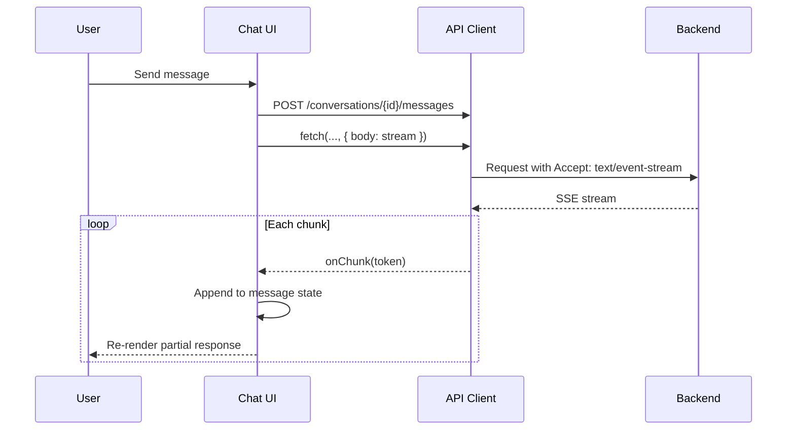

# ClinAI MVP — Frontend Architecture

**Version:** 0.1  
**Date:** 2025-02-19

---

## 1. Chat Architecture (Streaming)

### 1.1 Flow



### 1.2 Implementation

- **Transport:** `fetch` with `ReadableStream` or `EventSource`-like API for SSE
- **State:** Current message in `useState`; append tokens as they arrive
- **UI:** Streaming text with cursor/caret; mark complete when `[DONE]` or stream ends
- **Error:** On stream abort, show partial + error state; allow retry

### 1.3 API Contract (Conceptual)

```
POST /conversations/{conversation_id}/messages
Body: { content: string, anonymize?: boolean, assistenzmodus?: boolean, preset_id?: string }
Response: 200, Content-Type: text/event-stream
  data: {"type":"token","value":"..."}
  data: {"type":"done"}
  data: {"type":"error","message":"..."}
```

---

## 2. Folder Model

### 2.1 Structure

- Flat or tree (MVP: flat or one level)
- Folder: `id`, `name`, `tenant_id`, `parent_id` (optional)
- Conversation: `folder_id` (nullable = "Unfiled")

### 2.2 UI

- Sidebar: List folders; "Unfiled" or default
- Create/rename/delete folder
- Drag conversation to folder (or dropdown)
- No circular references in MVP

### 2.3 State

- `folders` from `GET /folders` (TanStack Query)
- `conversations` from `GET /conversations?folder_id=...`
- Optimistic updates on create/rename/delete

---

## 3. Preset Prompt Architecture

### 3.1 Server-Side Versioned Prompts

- Presets stored in DB: `id`, `key`, `version`, `body`, `tenant_id` (optional for global)
- API: `GET /presets` → list; `GET /presets/{id}` → body (if needed)
- Client: Sends `preset_id` with message; server injects preset body into system prompt

### 3.2 Client Flow

1. Fetch presets: `GET /presets`
2. User selects preset from dropdown (e.g. "Dokumentationshilfe", "Verlaufsnotiz")
3. On send: include `preset_id` in request
4. Server builds system prompt: BASE + PRESET + ASSISTENZMODUS + ANON

### 3.3 Versioning

- Presets have `version`; API returns latest unless version pinning needed
- MVP: Single active version per preset
- Phase 2: A/B or version history

---

## 4. Assistenzmodus System Prompt Injection

### 4.1 Model

- Assistenzmodus = "assistant mode" with specific instructions
- Toggle in UI: on/off
- When on: server appends Assistenzmodus block to system prompt

### 4.2 Flow

```
User toggles Assistenzmodus ON
  → Frontend stores in conversation context or per-message
  → On send: { assistenzmodus: true }
  → Server: system_prompt += ASSISTENZMODUS_PROMPT
```

### 4.3 Server-Side Only

- Assistenzmodus prompt text never in client bundle
- Stored in config or DB; server fetches and injects

---

## 5. Anonymization Toggle Flow

### 5.1 UI

- Toggle: "Anonymisieren" (or similar)
- Default: Configurable per tenant (e.g. on by default)
- Scope: Per conversation or per message (MVP: per message for flexibility)

### 5.2 Flow

```
User toggles Anonymize ON
  → Frontend sends { anonymize: true } with message
  → Server runs anonymization on user content before sending to OpenAI
  → Server sends anonymized text to LLM
  → Response stored; no reverse mapping in MVP
```

### 5.3 Storage

- Original user message can be stored (for history) or anonymized version
- **GDPR:** If original stored, ensure retention and deletion aligned
- **MVP recommendation:** Store original; anonymization is only for LLM input

---

## 6. Route Structure (Conceptual)

```
/                     → Redirect to /chat or /login
/login                → B2C redirect
/callback             → B2C callback, store token
/chat                 → Main chat view (conversation list + active chat)
/chat/:conversationId  → Single conversation
/folders              → Folder management (or sidebar)
/settings             → User/tenant settings
```

---

## 7. State Management Summary

| State | Location | Notes |
|-------|----------|-------|
| Auth token | Memory + secureStorage (optional) | No sensitive in localStorage if XSS risk |
| Folders | TanStack Query | Cache, refetch on mutation |
| Conversations | TanStack Query | Per folder |
| Active conversation | Zustand or URL | Current chat context |
| Streaming message | useState | Append tokens; clear on complete |
| UI toggles | Zustand | Assistenzmodus, anonymize, sidebar open |
| Presets | TanStack Query | List from API |

---

## 8. Error / Empty / Loading States

| Scenario | UI |
|----------|-----|
| No conversations | Empty state + CTA "New conversation" |
| No folders | Default "Unfiled"; option to create |
| Stream error | Partial text + error banner + retry |
| Network error | Toast + retry |
| 403 | Redirect to login or show "Access denied" |
| Loading conversation | Skeleton or spinner |
