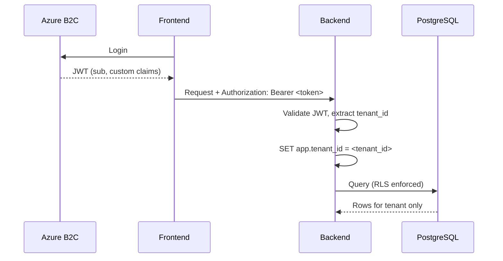

# MentalCarePilot MVP — Multi-Tenancy & Data Isolation Design

**Version:** 0.1  
**Date:** 2025-02-19

---

## 1. Tenant Isolation Strategy

### Options Considered

| Strategy | Pros | Cons | Decision |
|----------|------|------|----------|
| **Single DB + shared schema + RLS** | Simple, cost-effective, one codebase | Logical isolation only | ✅ **Chosen** |
| Schema-per-tenant | Strong isolation | Many schemas, migration complexity | Rejected |
| DB-per-tenant | Maximum isolation | High operational cost | Rejected |

**Choice:** Single database, shared schema, Row-Level Security (RLS) on all tenant-scoped tables. Zero cross-tenant leakage via RLS + application-layer enforcement.

---

## 2. Tenant-Scoped Tables

All tables with tenant data must include `tenant_id` and enforce RLS:

| Table | tenant_id | RLS |
|-------|-----------|-----|
| tenants | PK | N/A (lookup by id) |
| users | FK → tenants | ✅ |
| folders | FK → tenants | ✅ |
| conversations | FK → tenants | ✅ |
| messages | via conversations | ✅ (join check) |
| preset_prompts | FK → tenants (nullable for global) | ✅ |
| audit_logs | FK → tenants | ✅ |
| llm_audit_logs | FK → tenants | ✅ |
| usage_records | FK → tenants | ✅ |

---

## 3. Row-Level Security Design

### 3.1 RLS Policy Pattern

```sql
-- Example: folders table
ALTER TABLE folders ENABLE ROW LEVEL SECURITY;

CREATE POLICY tenant_isolation ON folders
  USING (tenant_id = current_setting('app.tenant_id')::uuid);

-- Application sets per-request:
SET app.tenant_id = '<resolved_tenant_id>';
```

### 3.2 Session Variable

- Middleware resolves `tenant_id` from JWT
- Sets `app.tenant_id` at start of each request (connection/session scope)
- All queries in that request use the same tenant context

### 3.3 Service Account Bypass

- Migrations and system jobs use a role with `BYPASSRLS`
- Application roles never bypass RLS

---

## 4. Tenant ID Propagation

### 4.1 Flow



### 4.2 B2C Token Claim Mapping

| Claim | Source | Use |
|-------|--------|-----|
| `sub` | B2C | user_id |
| `oid` | B2C | Object ID (optional) |
| `extension_tenant_id` or `tenant_id` | Custom B2C attribute | tenant_id |
| `extension_role` or `role` | Custom attribute | role (therapist, admin) |

**Configuration:** B2C User Flow → Application claims → add custom attributes. Map `extension_tenant_id` to `tenant_id` in middleware.

### 4.3 Fallback

If `tenant_id` not in token:
- **Option A:** Resolve from `users` table by `sub` → `tenant_id`
- **Option B:** Reject request 403 (no tenant context)

**Recommendation:** Store `user_id → tenant_id` in DB; use B2C claim when present, else lookup. Ensures tenant always available.

---

## 5. Enforcement Middleware

### 5.1 Order of Operations

1. Validate JWT (signature, expiry)
2. Extract `sub` (user_id), `tenant_id` (claim or DB lookup)
3. Set `request.state.tenant_id`, `request.state.user_id`
4. For DB: `SET app.tenant_id = request.state.tenant_id` (per-connection or per-request)
5. Reject if `tenant_id` is missing

### 5.2 Code Sketch (FastAPI)

```python
# Pseudo-code
@app.middleware("http")
async def tenant_context(request, call_next):
    token = request.headers.get("Authorization")
    claims = validate_and_decode(token)
    tenant_id = claims.get("tenant_id") or await resolve_tenant_from_user(claims["sub"])
    if not tenant_id:
        return JSONResponse(status_code=403, content={"detail": "No tenant context"})
    request.state.tenant_id = tenant_id
    request.state.user_id = claims["sub"]
    response = await call_next(request)
    return response
```

### 5.3 DB Session

- Use connection/session-scoped `SET LOCAL app.tenant_id` before any query
- Or: Use SQLAlchemy event to inject `tenant_id` in all `WHERE` clauses (less reliable) — prefer RLS + `SET`

---

## 6. Zero Cross-Tenant Leakage Guarantees

| Mechanism | Purpose |
|-----------|---------|
| RLS | DB-level; blocks cross-tenant reads/writes even if app has bug |
| Middleware | Ensures tenant_id in every request |
| API design | No tenant_id in URL; derived from auth only |
| Audit | Log tenant_id with each audit event (no PII) |

---

## 7. Audit Trail

- `audit_logs` table: `tenant_id`, `actor_id`, `action`, `entity_type`, `entity_id`, `assist_mode`, `model_name`, `model_version`, `input_tokens`, `output_tokens`, `ts` (extended 2025-02-20 for LLM actions)
- `usage_records` table: `tenant_id`, `user_id`, `ts`, `assist_mode`, `model_name`, `input_tokens`, `output_tokens` — for KPI aggregation
- No PII in audit payload; no prompt/response content
- Retain per retention policy
- Queryable per tenant only (RLS); Admin scope=tenant, User scope=me

---

## 8. No Prompt Data in Logs

- LLM request/response bodies **never** in application logs
- Log only: `correlation_id`, `tenant_id`, `request_type=llm`, `token_count`, `latency_ms`, `status`
- See LLM_SECURITY_AND_GDPR.md for details
