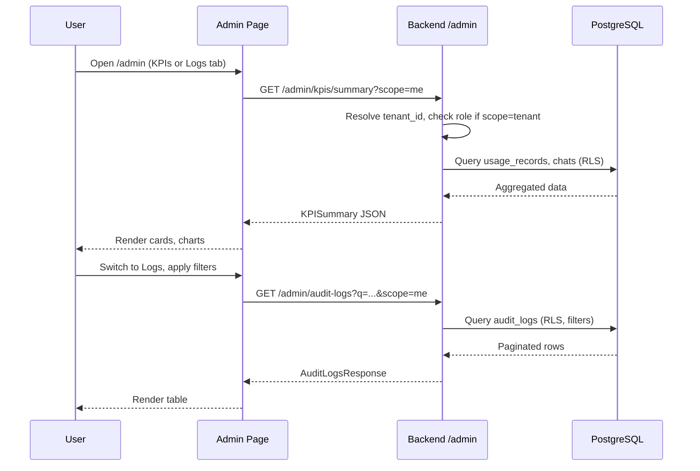

# Admin KPIs and Audit Logs Flow

**Date:** 2025-02-20

## Data flow

```mermaid
flowchart TB
    subgraph Client["Frontend Admin"]
        AdminPage[Admin Page]
        KPITab[KPIs Tab]
        LogsTab[Logs Tab]
    end

    subgraph API["Backend API /admin"]
        KPIEndpoints["/admin/kpis/*"]
        AuditEndpoint["/admin/audit-logs"]
    end

    subgraph DB["PostgreSQL"]
        UsageRecords[(usage_records)]
        AuditLogs[(audit_logs)]
        Chats[(chats)]
    end

    subgraph WritePath["Write Path (no content)"]
        ChatStream[Chat Streaming]
        ExportEndpoint[Export /chats/{id}/export]
        ChatStream --> UsageRecords
        ChatStream --> AuditLogs
        ExportEndpoint --> AuditLogs
    end

    AdminPage --> KPITab
    AdminPage --> LogsTab
    KPITab --> KPIEndpoints
    LogsTab --> AuditEndpoint
    KPIEndpoints --> UsageRecords
    KPIEndpoints --> Chats
    AuditEndpoint --> AuditLogs
```

## Admin read sequence



## Role-based scope

- **scope=me**: HCP User sees only own KPIs and own logs (filtered by actor_id/user_id)
- **scope=tenant**: HCP Admin sees tenant-wide KPIs and tenant-wide logs; requires admin role
