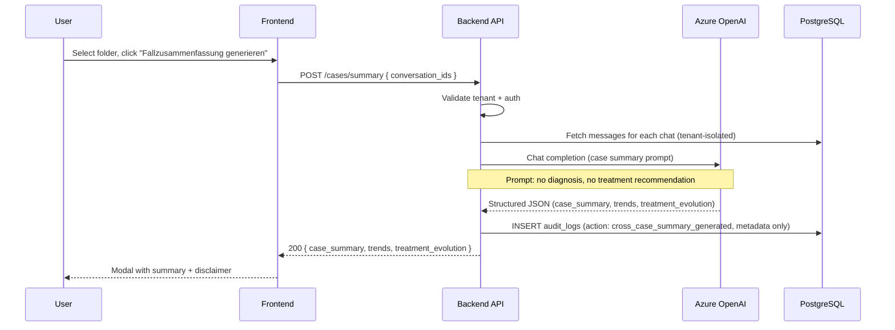

# Case Summary (Cross-Conversation) Flow

Draft support only. No diagnosis. No treatment recommendation. No automatic storage.

**Related flow:** Triggered from [Folder Management](folder-management-flow.md) — user selects folder, then clicks "Fallzusammenfassung generieren".

## Compliance

- **No automatic storage** of summary output unless user explicitly saves
- **No diagnosis** wording in prompt or output
- **No treatment recommendation** in prompt or output
- **Disclaimer** in UI: "KI-gestützte Zusammenfassung – keine diagnostische Entscheidung."
- **Audit** metadata only (conversation_ids, count); no content in logs
