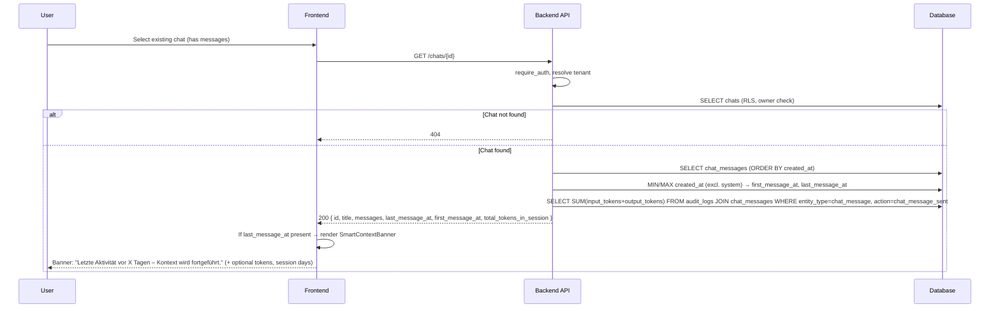

# Continue Session – Smart Context Banner Flow

**Date:** 2026-02-20

When a user opens an existing chat that has messages, a contextual banner shows "Letzte Aktivität vor X Tagen – Kontext wird fortgeführt." plus optional session length (days) and total tokens used. No LLM changes; read-only enhancement.

## Sequence

## API Extension

| Endpoint | New Response Fields |
|----------|---------------------|
| `GET /chats/{id}` | `last_message_at` (ISO8601 \| null), `first_message_at` (ISO8601 \| null), `total_tokens_in_session` (int, default 0) |

## Token Aggregation Source

Tokens are computed from `audit_logs` where `entity_type='chat_message'` and `action='chat_message_sent'`, joined to `chat_messages` on `entity_id = chat_messages.id`, summed per `chat_id`. No `usage_records.chat_id` required.

## UI Rules

- Banner only shown when `last_message_at` is set (chat has ≥1 non-system message).
- Time-ago text: "weniger als 1 Minute", "vor X Minuten", "vor X Stunden", "vor X Tagen" (de-DE).
- Optional: session length (days between first and last message), total tokens.
