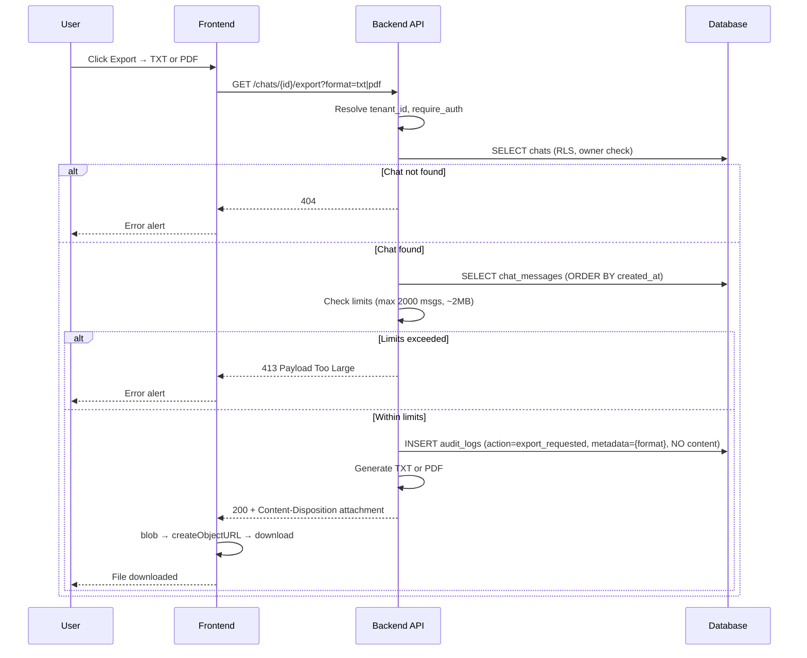

# Chat Export Flow (PDF / TXT)

**Date:** 2025-02-20

## Sequence

## Compliance

- **Audit:** `export_requested` in `audit_logs` with `entity_type=chat`, `metadata.format=txt|pdf` only. No prompt/response content.
- **Generation:** In-request; no blob storage for MVP. File streamed directly.

## API

| Endpoint | Format | Response |
|----------|--------|----------|
| `GET /chats/{id}/export?format=txt` | Plain text | `text/plain; charset=utf-8` |
| `GET /chats/{id}/export?format=pdf` | PDF | `application/pdf` |
| `GET /chats/{id}/export.txt` | Legacy | Same as format=txt |
