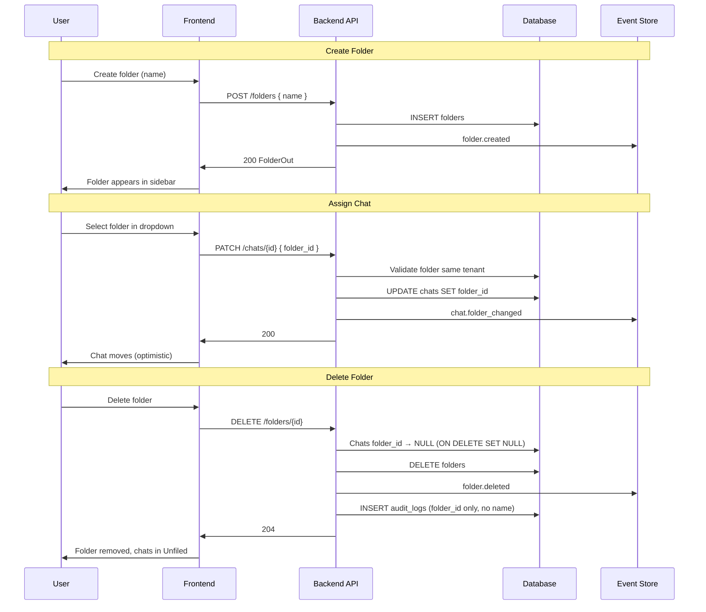

# Folder Management Flow

```mermaid
sequenceDiagram
    participant U as User
    participant FE as Frontend
    participant API as Backend API
    participant DB as Database
    participant ES as Event Store

    Note over U,ES: Create Folder
    U->>FE: Create folder (name)
    FE->>API: POST /folders { name }
    API->>DB: INSERT folders
    API->>ES: folder.created
    API->>FE: 200 FolderOut
    FE->>U: Folder appears in sidebar

    Note over U,ES: Assign Chat
    U->>FE: Select folder in dropdown
    FE->>API: PATCH /chats/{id} { folder_id }
    API->>DB: Validate folder same tenant
    API->>DB: UPDATE chats SET folder_id
    API->>ES: chat.folder_changed
    API->>FE: 200
    FE->>U: Chat moves (optimistic)

    Note over U,ES: Delete Folder
    U->>FE: Delete folder
    FE->>API: DELETE /folders/{id}
    API->>DB: Chats folder_id → NULL (ON DELETE SET NULL)
    API->>DB: DELETE folders
    API->>ES: folder.deleted
    API->>DB: INSERT audit_logs (folder_id only, no name)
    API->>FE: 204
    FE->>U: Folder removed, chats in Unfiled
```

**Related flow:** [Case Summary (Cross-Conversation)](case-summary-flow.md) — when a folder is selected, users can generate a case summary from its chats.
