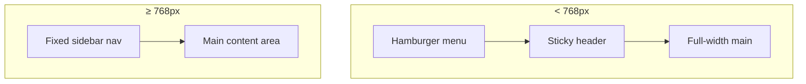
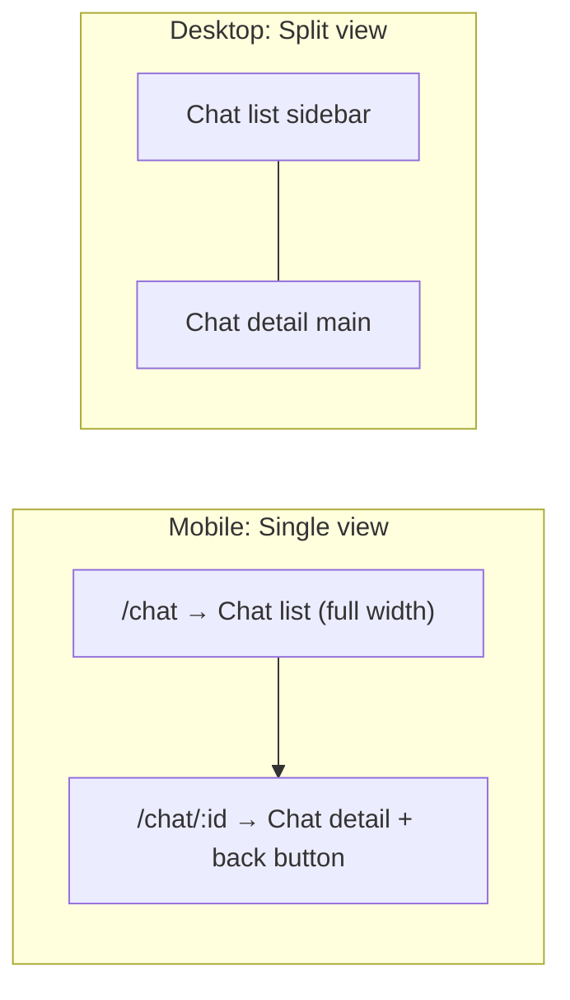

# Mobile-Responsive Layout

**Feature:** Mobile-first UI for MentalCarePilot  
**Breakpoints:** xs 390px | sm 640px | md 768px | lg 1024px | xl 1280px

## Layout Strategy

## Chat Page Layout

## Touch Targets

- Primary actions: `min-h-touch` / `min-w-touch` (44px)
- Applied to: nav links, create chat, send, dictation (mic), back, ErrorBoundary retry

## Design Tokens

- Primary: `#0ea5e9` (primary-500), `#0284c7` (primary-600)
- No hardcoded colors outside Tailwind tokens
