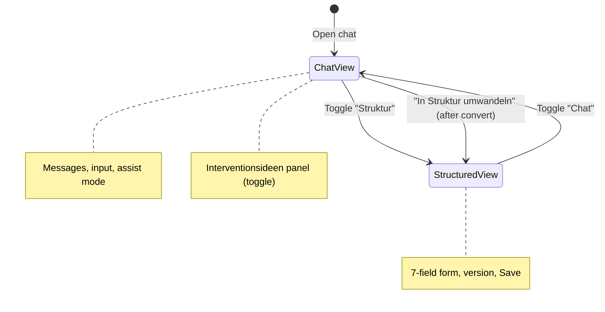
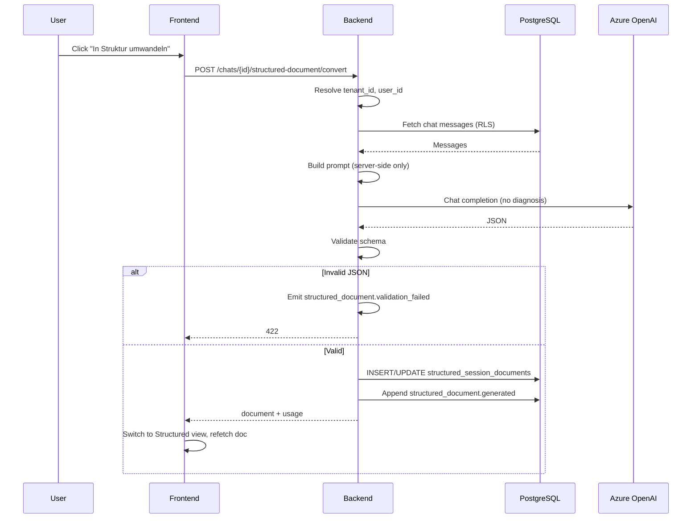
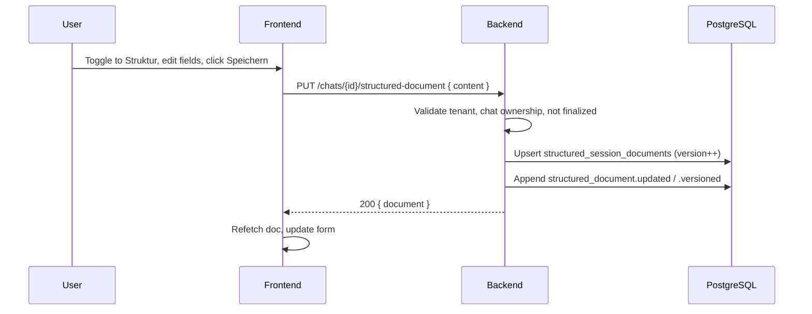
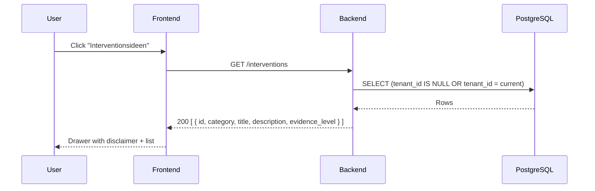
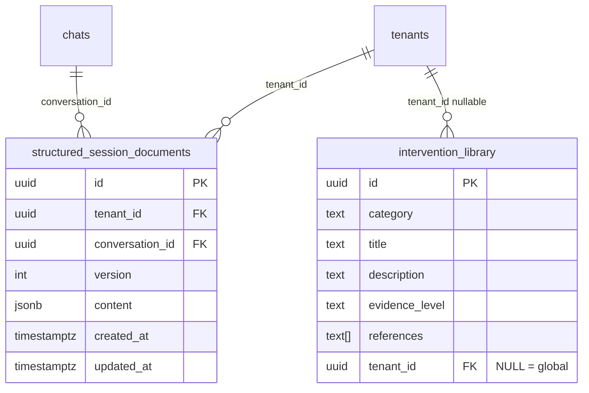

# Structured Session Documentation Flow (EPIC 14)

**Date:** 2026-02-20

## Overview

- **1.1** Structured Session Templates: Chat / Structured view toggle; form with 7 optional fields; versioned documents.
- **1.2** Intervention Library: Evidence-informed, non-prescriptive suggestions; global + tenant entries.
- **1.3** Convert: Server-side LLM transforms conversation → structured JSON → validate → store.

---

## UI state flow (Chat page)

---

## Sequence: Convert to Structured Documentation

---

## Sequence: Manual create/update (Structured view)

---

## Sequence: Intervention panel

---

## Data model

- **RLS:** `structured_session_documents`: tenant_id = current. `intervention_library`: tenant_id IS NULL OR tenant_id = current.

---

## Events

| Event | When |
|-------|------|
| `structured_document.created` | First manual or generated doc for conversation |
| `structured_document.updated` | Content saved (same version row updated) |
| `structured_document.versioned` | New version saved |
| `structured_document.generated` | Convert flow succeeded |
| `structured_document.validation_failed` | LLM returned invalid JSON |
| `intervention_viewed` | User viewed intervention entry (no PII) |

---

## Related

- **Export:** PDF can include a "Strukturierte Dokumentation" section when a structured doc exists for the chat. See [export-chat-flow.md](export-chat-flow.md).
