# Voice-to-Text Dictation Flow

**Feature:** Browser-based speech-to-text for chat message input. No audio stored or uploaded.

## Flow

```mermaid
sequenceDiagram
    participant U as User
    participant UI as Chat UI
    participant API as Web Speech API
    participant Backend as Backend

    U->>UI: Click microphone icon
    UI->>API: start() (browser)
    Note over UI: "Aufnahme läuft..."
    U->>API: Speak
    API->>UI: onresult (interim)
    U->>UI: Click stop
    UI->>API: stop()
    API->>UI: onend + transcript
    UI->>UI: Insert text into input
    U->>UI: Edit (optional) + Send
    UI->>Backend: POST message (text only)
```

## Compliance

- **No audio stored:** Transcription happens in-browser; only text is sent.
- **No audio uploaded:** Web Speech API processes locally (Chrome) or via browser vendor service; app never receives raw audio.
- **Anonymization:** Unchanged; applies to typed or dictated text alike.

## Browser Support

- Chrome, Edge: `webkitSpeechRecognition`
- Safari (newer): `SpeechRecognition`
- Firefox: Not supported (mic button hidden)
